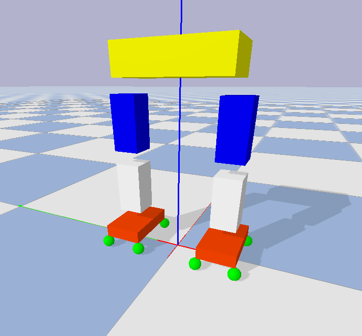
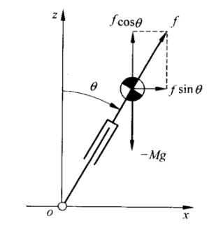
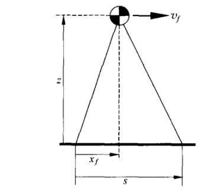

# Humanoid-Walking-Pattern-Generator
Use Traditional Method ZMP and Learning Method PPO to generate Walking Pattern for Humanoid Robot

#### Requirements

- Pinocchio
- gym 
- Pybullet
- Numpy

#### Env

- Simple Robot with eight force sensors under the feet

#### ZMP

- 2D inverted pendulum

  

  There are several differential equations as below

  

- 2D linear inverted pendulum

  When = 0 and f = Mg/cos,  the Centroid will remain the same height as the pendulum falling. Because f * cos= Mg .

  

  In the horizontal direction

   

  given initial state x(0) x'(0) and target state x(t) x'(t) compute used time

  

  orbital energy

  

- Change Feet

  
  Given orbital energy

  

