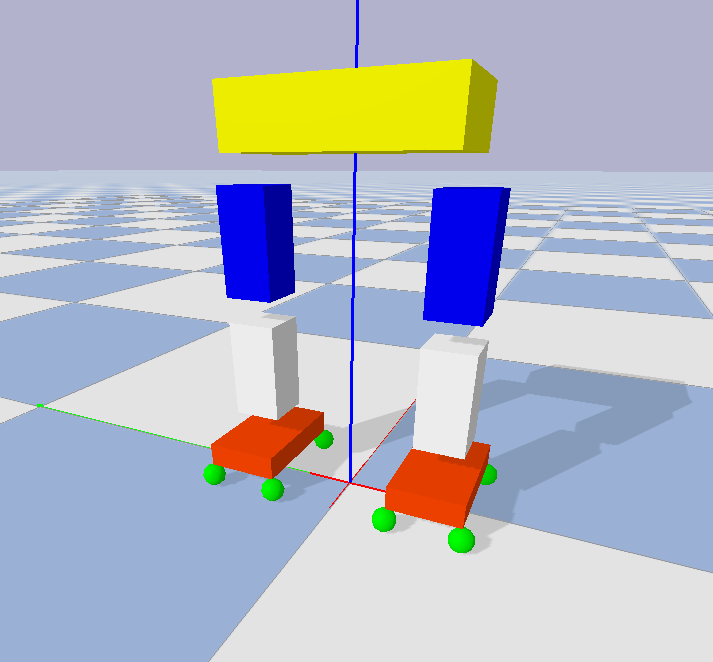

# Humanoid-Walking-Pattern-Generator
Use Traditional Method ZMP and Learning Method PPO to generate Walking Pattern for Humanoid Robot

#### Requirements

- Pinocchio
- gym 
- Pybullet
- Numpy

#### Env

- Simple Robot with eight force sensors under the feet
